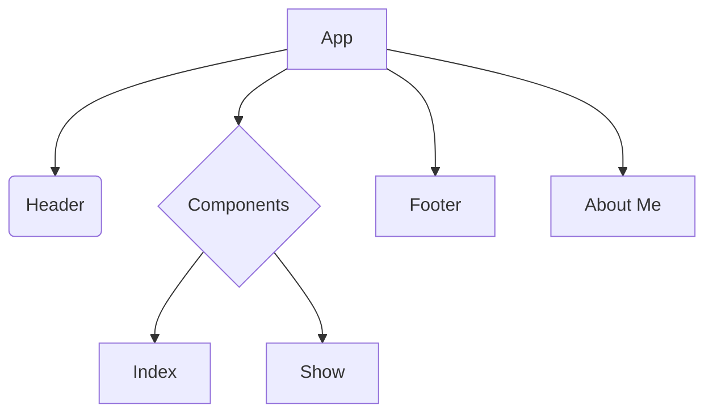

# Product Requirements Documentation
### By Haley Zitzmann

**Summary**
| Field | Detail |
|-------|--------|
| Blog App | {My Blog}|
| Description | {I am building a full CRUD application that allows the users to write and post their own blog posts. The user can also post pictures and blog posts will be dated.} |
| Developers | {Haley Zitzmann} |
| Live Website | {https://project-4-backend-ii.onrender.com} |
| Repo | {https://github.com/zitzmah/Project-4-Backend-II} |

## User Stories

List of stories users should experience when using the application.

- Users should be able to see the site on desktop and mobile
- Users can create a new item
- Users can see all their items on the dashboard
- Users can update items
- User can delete items

## Route Tables

| Endpoint | Method | Response | Other |
| -------- | ------ | -------- | ----- |
| /item | GET | JSON of all items | |
| /item | POST | Create new item return JSON of new item | body must include data for new item |
| /item/:id | GET | JSON of item with matching id number | |
| /item/:id | PUT | update item with matching idea, return its JSON | body must include updated data |
| /item/:id | DELETE | delete the item with the matching id | |
| /auth/signup | POST | creates new user account returns user JSON | new user info must be included in body |
| /auth/login | POST | logs in user and returns user JSON with JWT token | username and password must be included in body |

## Component Architecture

